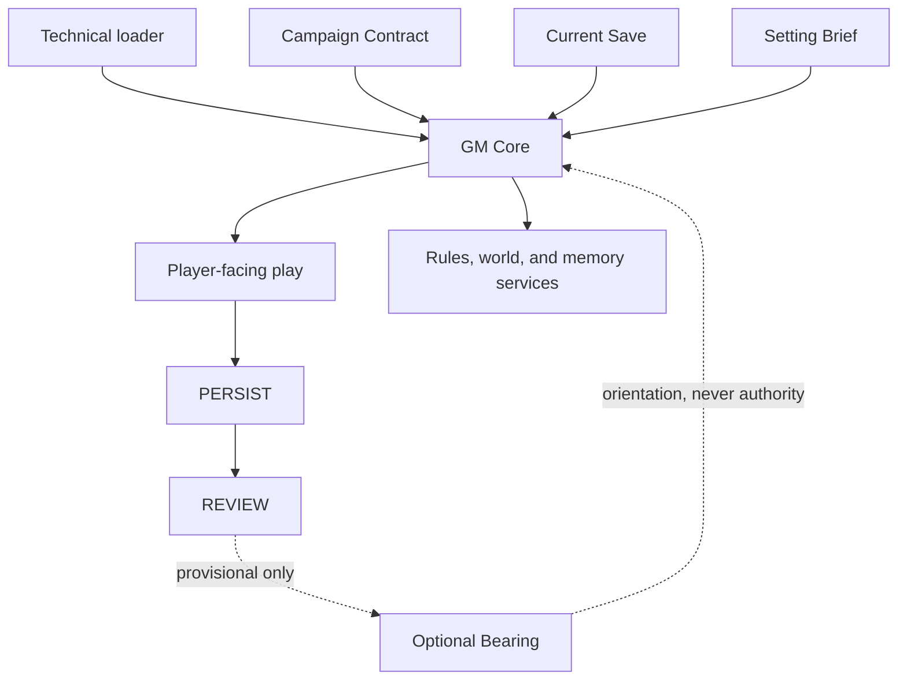

# RPG OS v0.6.2 architecture

## The short version

RPG OS is built around one priority:

> **The GM imagines and judges. The rules constrain and clarify. The files remember.**

Earlier prototypes proved that a campaign could be stored outside a disposable chat, but their runtime could act like a careful clerk: retrieve, answer narrowly, wait. v0.6 changes the center of gravity. The AI must first understand the campaign and the player's intent, decide what GM work is owed, and only then retrieve the facts or procedure needed to do that work.

The architecture separates four different kinds of information so that they cannot quietly borrow authority from each other:

| Object | Plain-language job | Authority |
|---|---|---|
| **GM Core** | How the AI must GM: orient, frame, portray, judge, preserve agency, and close or return a playable situation | Runtime law |
| **Campaign Contract** | The campaign you explicitly accepted: its promise, boundaries, style axes, and any permission for proactive GM initiative | Durable run authority |
| **Current Save** | What is true now, including the immediate situation and established causes that can still matter | Canonical present |
| **Bearing** | A revisable reading of what the campaign may be becoming | Optional and noncanonical |

Rules, world files, character records, private state, and archive evidence sit below this control layer as services. They are opened when the GM task needs them.

A compact **Setting Brief** is the one deliberate exception to purely task-triggered world retrieval. It is a bound module's small, stable public baseline, loaded once before first fiction so generic model assumptions do not erase the world's ordinary reality. It orients the GM; it does not summarize the campaign or activate content.

## Core terms

- **Campaign Contract:** the accepted agreement for one run. A reusable module may suggest defaults, but the bound run owns its actual Contract.
- **Setting Brief:** a compact module authority containing the world's identity, foundational facts that define what is ordinary, and a map of available cold depth. It contains no current mutable state or future-event entitlement.
- **Causal frontier:** the compact part of Current Save that names established consequences, due conditions, live processes, pending decisions, and narrow current-state cues that may matter next. Separate Current Save fields preserve explicitly declared PC goals and uncommitted PC time. None is a plot queue.
- **Bearing:** an optional REVIEW output based on a particular save and Contract revision. It may describe provisional patterns or questions. It is never evidence that those interpretations are true.
- **PERSIST:** the fact-recording side of administration. CHECKPOINT saves the present; CLOSE saves the present and archive evidence.
- **REVIEW:** a separate campaign-level look back. It may revise Bearing but may not edit canon.
- **RECALIBRATE:** an explicitly accepted, prospective change to the Campaign Contract.
- **Cold:** not part of normal resident context. Cold material may exist on disk without gaining importance, authority, or permission to appear.

## Runtime stack

The storage directories remain familiar:

| Layer | Responsibility |
|---|---|
| `OS/` | GM Core, loader, boot, agency, safety, runtime authority, and the cold task-first retrieval service |
| `ENGINE/` | Resolution procedures and mechanical sheet requirements |
| `MODULES/` | Reusable world baseline, voice, definitions, and optional capability bodies |
| `INSTANCE/` | One run's Contract, Current Save, PC/person overlays, current systems, corrections, safety, and optional Bearing |
| `ARCHIVE/` | Accepted historical evidence and exact-recall routes |
| `ADMIN/` | Setup, loading, persistence, review, recalibration, validation, and tests |

The conceptual direction is:



## Boot and resident context

The fixed technical boot set is:

1. `OS/AGENTS.md`
2. `OS/BOOTSTRAP.md`
3. `OS/LAW.md`
4. `INSTANCE/CURRENT_SAVE.md`
5. `INSTANCE/CAMPAIGN_CONTRACT.md`

For a bound run, boot follows the active-safety route, loads the module's required `SETTING_BRIEF.md` once, then follows the required-voice route before first fiction. It loads `INSTANCE/BEARING.md` only when the Contract enables `review_mode: bearing-only` and the Bearing's `base_save_id`, `base_save_rev`, `base_contract_id`, and `base_contract_rev` match the current authorities. Missing or stale Bearing is nonfatal.

The Setting Brief is intentionally narrow:

- **World identity:** the public premise and broad frame.
- **What is ordinary:** foundational public facts that generic model priors might otherwise erase.
- **Available depth:** broad cold domains the GM can retrieve later when an actual task needs precision.

It excludes named rosters, current mutable state, active seeds, clock or phase bodies, private truth, prepared scenes, detailed lore, and plot queues. Current Save and narrower authoritative records still control details that change or require precision. Loading the brief never activates an event, person, or possibility.

Detailed world files, archive bodies, rosters, rule bodies, private truth, clocks, seeds, and other capabilities remain cold until the current GM task calls for them. The important bound is not an arbitrary number of files; it is context sufficient and proportionate to GM well.

## The GM-first loop

For each turn, the runtime works in this order:

1. **Orient:** where the body, scene, and campaign are; what is already in motion.
2. **Understand intent:** distinguish an in-character act or goal from OOC preference, correction, or ADMIN command.
3. **Identify the task:** perception, portrayal, adjudication, transition, closure, retrieval, or administration.
4. **Check authority:** is this a required response, established consequence, authorized procedure, external warrant, or accepted creative mandate?
5. **Retrieve enough:** open only facts and procedures sufficient and proportionate to that task.
6. **Imagine and judge.**
7. **Render:** communicate only the selected fictional result, mechanics actually used, necessary OOC clarification, and required public state; omit internal routes, checks, rejected alternatives, and compliance explanations.
8. **Return agency or close the beat.**

This order is an instruction-level control inside one model context. v0.6.2 does not require hidden chain-of-thought, multiple agents, or a physically isolated renderer pass. That portability is useful, but it also means file-route, adjudication-rationale, or rejected-candidate leakage remains possible and must be tested semantically.

## Creation without railroading

Unauthored material is not automatically forbidden. The GM may supply concise texture and ordinary function, frame transitions, and portray established NPCs and world processes. Consequential new situations need independent authority:

- an operative established cause;
- a specific due condition;
- a PC-declared goal;
- an explicit OOC request;
- an authorized procedure; or
- an explicitly accepted creative mandate at an eligible boundary.

General setting fit is only compatibility. It does not authorize a specific incident. A prepared or retrieved idea cannot manufacture its own justification. The GM may choose no discretionary development, and quiet or solitary play remains valid; it still must supply enough orientation for the player to act or cleanly close the beat.

Warrant and fit are conjunctive for prospective authorship: a warrant or responsive request does not waive the accepted fit envelope or hard boundaries. Already-established facts and consequences remain real; a requested change to the accepted kind of campaign is handled OOC through RECALIBRATE.

The public v0.6.2 kit ships **no durable GM-preparation bank**. A module may still contain cold seeds or possibilities under the ordinary nonactivation rules. Bearing may hold provisional interpretation and questions, but not a queue of scenes waiting for activation. Fresh lawful realization remains available without preparation; authority is still required, and selecting no discretionary development remains valid.

## Campaign Contract

`INSTANCE/CAMPAIGN_CONTRACT.md` is a compact, run-scoped authority accepted during NEW GAME or LOAD. It records:

- campaign promise and fit envelope;
- structural direction;
- GM initiative;
- pressure or incident density;
- time handling;
- development priorities;
- guidance visibility;
- the scope and eligible boundaries of any creative mandate;
- REVIEW mode.

Those axes calibrate style and frequency. They do not impose scene quotas or authorize a particular person, clue, complication, or outcome. Changing them requires RECALIBRATE and explicit acceptance. The change applies prospectively, gets a new Contract identity, and makes an older Bearing stale.

## Current Save and causal frontier

`INSTANCE/CURRENT_SAVE.md` remains the canonical present. In addition to time, place, body, resources, and the immediate situation, v0.6 gives it a compact causal frontier through:

- `scene_status`;
- `uncommitted_time`;
- `pc_declared_goals`;
- `causal_frontier`.

These fields help a fresh GM recognize what is operative instead of treating a new chat as an isolated request. Only established material belongs there. A possibility, inferred player desire, or REVIEW hypothesis cannot be promoted into the frontier.

Absence from the frontier means “not currently carried here,” not “nothing exists in the campaign.”

## Bearing

`INSTANCE/BEARING.md` is warm rather than resident: boot may load it for orientation when it is enabled and current.

It can separate:

- established developments by reference;
- PC-declared goals;
- explicit OOC preferences;
- observed conduct without inferred desire;
- provisional pattern or trajectory hypotheses;
- active, weakening, contradicted, or retired directions;
- questions worth watching;
- “no stable pattern yet.”

It cannot establish facts, tick clocks, change relationships, prove player interest, supply a warrant, or outrank the Contract or Current Save. A failed or skipped REVIEW therefore cannot corrupt a valid campaign.

## PERSIST, REVIEW, and END SESSION

PERSIST and REVIEW answer different questions:

| Operation | Question | May write |
|---|---|---|
| CHECKPOINT | What is true now? | Current authoritative INSTANCE state and Current Save |
| CLOSE | What is true now, and what exact evidence should be retained? | The same present plus archive shards, indexes, and ledgers |
| REVIEW | What may this campaign be becoming? | Current provisional Bearing only |

PERSIST never infers a preferred trajectory. REVIEW never changes state, history, clocks, people, safety, or Contract.

`END SESSION` sequences the operations safely: CLOSE first; only after it succeeds, and only when the Contract enables bearing review, REVIEW second. Results are reported separately. If REVIEW fails, the successful save remains valid.

## Task-first retrieval and retrieval locality

Apart from the compact Setting Brief loaded for session-start awareness, RPG OS does not load a lore bible merely because the campaign has one. After the GM identifies the task, it follows explicit routes to the smallest authoritative unit that is sufficient:

```text
large domain -> compact routing index -> narrow authoritative record
```

Split by independent retrieval relevance, not an arbitrary word count. A cohesive long file may be correct. A shorter file mixing unrelated subjects may be wrong. Do not prebuild empty hierarchies.

Indexes answer “where should I look?” They do not duplicate content, grant narrative importance, authorize an event, or invite sibling browsing. A whole-file tool response can still inject unrelated text into one model context; physical sharding reduces that risk but does not prove isolation.

## Complex campaigns

The architecture can support phases, causal clocks or fronts, autonomous people and institutions, resources, calendars, relationships, private truth, house rules, and large retrieval-local worlds.

These systems remain optional and domain-specific:

- stable definitions and T0 baselines live in MODULE;
- changing authoritative state lives in INSTANCE;
- due or operative state reaches the causal frontier only when established;
- reading a clock does not tick it;
- a session ending does not tick it unless the accepted rule says so;
- a phase describes changed operating conditions, not a compulsory chapter;
- a seed or possibility remains inactive merely because it exists.

Complex machinery supplies world causality. It does not replace GM judgment or create a plot quota.

## Engines

ENGINE is a rules service, not the OS. The public v0.6.2 kit bundles only `freeform`.

A user may install a compact local adapter for GURPS, Dungeons & Dragons, Pathfinder, Call of Cthulhu, Fate, Savage Worlds, another owned system, or original house rules if it follows `ENGINE/_CONTRACT.md`. Those examples are not bundled, endorsed, or reproduced by this project. An adapter records the minimum procedures and sheet fields needed to run; it must not reconstruct or redistribute a copyrighted rulebook.

House flavor and narration belong in campaign policy. A genuine resolution change belongs in an ENGINE adapter or explicit engine-level override, not in hidden prose.

## Archive and evidence

The archive is evidence, not the living world. CLOSE stores accepted play in semantic scene shards with compact indexes and stable headings. Exact wording, rolls, quantities, and disputed history come from the source shard; an index only routes there.

Retrieving old evidence does not make it currently relevant and cannot activate an NPC, seed, clock, event, or possibility. Legacy monolithic archives may remain readable. Migration is lossless partition and routing, never historical rewriting.

## Integrity and validation

`VALIDATE` and `TOOLS/validate.py` check deterministic structural conditions. They can help find malformed identities, routes, save fields, archive pointers, and other mechanically checkable drift.

They cannot prove:

- good GM judgment;
- correct warrant selection;
- agency or consent compliance;
- semantic archive fidelity;
- true host isolation;
- persistent write behavior;
- provider acceptance;
- a long campaign's future coherence.

Structural, host-observation, semantic, and player-rated evidence must remain separate. A green structural check is not a score for play quality.

## Known architectural limits

- **Single-context prose enforcement:** on ordinary hosts, the same model interprets controls, retrieves files, judges, and narrates. Instructions reduce but do not mechanically prevent leakage or rationalization.
- **No recovery of unsaved chat:** accepted play disappears if the chat is lost before CHECKPOINT or CLOSE.
- **Non-atomic multi-file writes:** publishing Current Save last protects the main pointer, but an interruption after another file was overwritten may still require inspection or backup restoration.
- **Host dependence:** folder reads, durable writes, and section handling vary by platform and can change.
- **Privacy limits:** file labels and headings are not security boundaries.
- **Provider limits:** RPG OS cannot override moderation, terms, or account enforcement.
- **Scale unproven:** v0.6.2 is not Session-100 evidence.

## Why the other designs were not chosen

A single resident mega-frame was rejected because it would place canon, interpretation, and possible future material on one permanent salience surface. A mandatory compiled session packet was rejected because it must predict relevance before the player acts and can become a stale second save.

A one-file packet may later be useful as a noncanonical export adapter for hosts without folders. It is not the v0.6.2 source of truth.
