# How RPG OS works

RPG OS v0.9.7 is an experimental file protocol for running a roleplaying campaign with an LLM. The model portrays the world and adjudicates play; readable Markdown records preserve the agreement, present state, rules, and evidence needed to continue across chats.

It is not a trained model, background server, autonomous simulation, or replacement for a rules engine. Its procedures tell a capable host how to use ordinary files. The model still has to read the right source, make sound judgments, and perform the agreed operations correctly.

This guide explains the mechanics behind [Quick start](../GAME/QUICKSTART.md). For compact technical ownership notes, see [Architecture](ARCHITECTURE.md); the linked operating files contain the full procedures.

**Optional write-only recording:** the selected [write-only play log](../GAME/ADMIN/PLAY_PERSISTENCE.md) appends one or two outcome sentences and leaves ongoing play in context. It performs no turn-level persistence reads, cross-checks or delivery protocol. ADMIN checkpoints compile actual changes from notes/conversation once; full SAVE additionally preserves original source and bounded review. Notes are working material, not complete dialogue or proof of delivery. Baseline examples below describe ordinary file-mode play unless stated; older trial reports do not describe this replacement workflow.

The worked scenes below are original fictional illustrations, not campaign records or observed playtests. Each supplies its own situation; examples do not share a world unless stated. Unless a scene demonstrates initialization, its participants already have an established encounter basis. **Player** and **GM** show what a chat can look like. The accompanying explanations reveal selected facts for the reader; ordinary narration does not print a private-state worksheet. Any displayed dice are fixed illustration inputs, not claims that a randomizer was used. Read these cases for explanation only. Their subjects, repetition and descriptive detail supply no generation weights or defaults; worldbuilding follows [NEW GAME’s neutrality rule](../GAME/ADMIN/NEW_GAME.md#neutrality-before-worldbuilding), and PLAY follows the governing source procedures.

## Contents

- [The operating loop](#the-operating-loop)
- [What lives where](#what-lives-where)
- [From fresh install to campaign](#from-fresh-install-to-campaign)
- [The agreement and authorship](#the-agreement-and-authorship)
- [Inside a turn](#inside-a-turn)
- [Independent people and other agents](#independent-people-and-other-agents)
- [Optional encounter generation: direction, then concrete state](#optional-encounter-generation-direction-then-concrete-state)
- [Random fallback for unresolved outcomes](#random-fallback-for-unresolved-outcomes)
- [Truth, knowledge, preparation, and history](#truth-knowledge-preparation-and-history)
- [Saving the present and preserving evidence](#saving-the-present-and-preserving-evidence)
- [Recovering interrupted work](#recovering-interrupted-work)
- [Handing an active scene to another GM](#handing-an-active-scene-to-another-gm)
- [Sources, visuals, and host capabilities](#sources-visuals-and-host-capabilities)
- [Exact retrieval and evidence audits](#exact-retrieval-and-evidence-audits)
- [What the checks establish](#what-the-checks-establish)

## The operating loop

The player supplies intentions and choices. The GM combines those with the accepted agreement, relevant records, and resolution rules. Accepted developments remain in the conversation until a save operation installs them in the workspace.

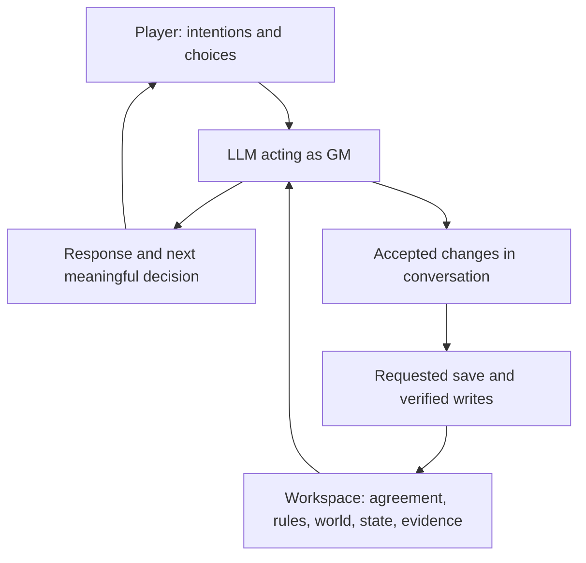

Conversation supplies temporary working context. Files supply durable, inspectable records. Merely mentioning a change does not establish that it was saved, and the existence of a file does not mean its contents are loaded into the model.

## What lives where

The fresh kit contains generic instructions and empty run templates. Campaign-specific records appear only through accepted setup and play. The tree below shows the main installed areas and the optional runtime areas created when needed.

```text
RPG_OS/
|-- OS/                    GM core, startup, targeted retrieval
|   `-- AGENT_STATE.md     Cold establishment and portrayal procedure
|-- ADMIN/                 Setup, saves, corrections, recovery, handover
|-- ENGINE/
|   |-- _CONTRACT.md       Adapter requirements
|   |-- freeform.md        Only bundled selectable rules adapter
|   `-- _shared/           Optional procedures for compatible engines
|-- MODULES/               Contracts; accepted worlds are added here
|-- INSTANCE/
|   |-- CURRENT_SAVE.md    Compact present and useful routes
|   |-- CAMPAIGN_CONTRACT.md
|   |-- CHAR/              Current character records after binding
|   |-- PEOPLE/            Current recurring-person records when needed
|   |-- KNOWN.md           What the played perspective has learned
|   |-- NOW.md             Current private and system state
|   `-- ...                Safety, corrections, routing, optional review
|-- ARCHIVE/               Indexes and accepted historical evidence
|-- EVIDENCE/              Optional raw captures; only README in the fresh kit
|-- TOOLS/                 Optional readers, search, audit helpers and tests
|-- RECOVERY/              Created for protected file operations
`-- HANDOVER/              Created for an authorized live-scene transfer
```

A module contains stable world material, source bindings and an opening baseline. ENGINE owns the selected generation and resolution mechanics; module facts constrain where those mechanics apply. An instance is one actual run through that material. Later mutable values belong in the instance, while unchanged world background remains in the module. Archives preserve what happened rather than competing with the current records over what is true now.

The layout does not require an encyclopedia or a file for every passing character. Records split when their subjects need independent retrieval. See the [module contract](../GAME/MODULES/_CONTRACT.md) and [instance schema](../GAME/INSTANCE/_SCHEMA.md).

## From fresh install to campaign

The public installation is **unbound**: no selected world, character, campaign history, or active handover. Freeform is the only bundled selectable engine, but setup still establishes the chosen engine. The shared encounter generator is an optional procedure, not an engine identity. Unbound describes installation state; it does not select a play style or override a host's capabilities.

Start with:

> Open OS/AGENTS.md. Start a new campaign with me using Quick start.

Quick start, Guided, and Detailed change the depth of the setup conversation. They are not different runtime engines. Quick start asks only what materially blocks a coherent proposal; supplied facts and deliberate unknowns remain useful.

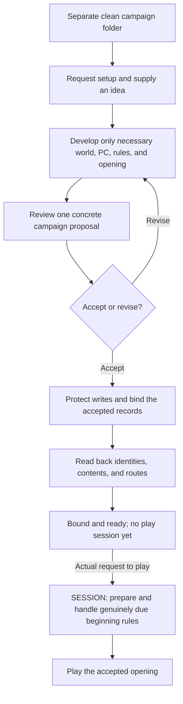

Binding gives the run its own campaign identity, save lineage, agreement identity, current PC bundle, and opening state. New Game does not clear a previous campaign to make room. Use a separate clean copy for another run.

World creation establishes a usable encounter-generation method for ordinary actors and necessary opening exceptions: supported sources, applicable fields, constraints, outcome meanings and the real input method where dice are chosen. Nature, control and capabilities govern the current fields; no universal human temperament or attraction table is imposed on organisms, machines, collectives or other beings. Existing individual facts retain priority, and a newly encountered kind needs compatible authority before dependent behavior.

Freeform uses established capabilities, circumstances, opposition, and stakes to judge uncertainty. It imposes no attribute list, compulsory dice system, or hidden stat block. A requested random method needs agreed meanings and an actual available randomizer or player-supplied result. More formal engines can be installed through the [adapter procedure](../GAME/ADMIN/ADD_ENGINE.md).

## The agreement and authorship

The accepted [campaign contract](../GAME/INSTANCE/CAMPAIGN_CONTRACT.md) turns preferences into concrete operating terms. Its five named clauses answer different questions:

| Clause | What it establishes |
|---|---|
| **Play form** | The accepted experience: exploration, missions, everyday life, directed chapters, or a described combination. |
| **Form selection** | Whether the GM may select a form, and the limits of that delegation. |
| **Structure disclosure** | What the player knows about the overall structure; plot secrets alone do not authorize concealing the form. |
| **Cuts** | Which transitions may compress or skip time, with meaningful reserved decisions preserved. |
| **Retcon** | Whether valid accepted outcomes may be rewound; genuine error correction remains a separate operation. |

The player controls the PC's voluntary actions, speech, inner experience, and commitments except for explicitly delegated scope. A biography, previous choice, or inferred preference grants no additional authority. The GM controls NPCs and world consequences within the agreement.

Initiative is meaningful without being compulsory incident generation. An established cause, applicable procedure, explicit request, or accepted initiative grant must justify a new consequential development before it is drafted. Permission to introduce trouble does not mean every scene owes trouble.

Routine compression covers the ordinary steps of the declared activity within its agreed scope. It stops before a new reserved decision or commitment. [LAW](../GAME/OS/LAW.md) defines these authorship and continuation rules; [Recalibrate](../GAME/ADMIN/RECALIBRATE.md) changes accepted terms prospectively.

### At the table: the ferry reaches a decision

In this Freeform fantasy campaign, routine travel within a declared journey may be compressed. The PC has already paid for passage to Bellwater; accepting employment remains the player's choice.

> **Player:** I take the ferry to Bellwater. I stay on deck and watch the banks.
>
> **GM:** Reed beds give way to the town's leaning warehouses. As the ferry rounds the last bend, a woman with a ledger braces herself beside the rail. “You travel light. I need someone to carry a sealed case from the landing to the governor's house. Five crowns, if you can go straight there.” The landing is coming into view.
>
> **Player:** “What is in the case?” I keep my hands off it.
>
> **GM:** “Glass instruments,” she says. “I can show you the packing, but I won't break the seals.” She holds the case where you can inspect it.

The crossing progresses within the declared trip. The GM offers an independently motivated person's proposal and stops before accepting the job, taking the case or changing the PC's destination. The woman's claim about the contents is testimony until supported; the player can investigate, negotiate or decline.

## Inside a turn

Startup checks recovery first, then loads the core, current save, and accepted contract. An active handover pauses source play. A bound run also reads its compact setting brief and any active operator limits; detailed lore and mechanics stay available for targeted retrieval. Every PLAY reply follows LAW's Understand → Establish → Resolve → Portray order. Routine dialogue may make each stage brief, but does not skip the relevant basis or source before authorship.

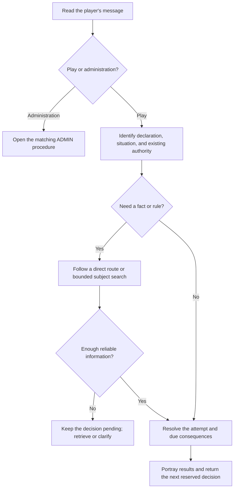

Retrieval asks what could materially change this response. Exact equipment needs the current character record. A disputed promise needs its evidence body. Ordinary conversation may need neither. Direct pointers can be followed immediately; an index is useful when the route is unclear.

After an event, Resolve carries its established changes into current working state before continuing, including what each affected entity actually perceived. An observer may remember a distinctive coat without having seen a face; being in the room does not prove either observation. Preserve the information at its actual scope even if that witness later leaves, while allowing inconsequential temporary mood to expire. This is a working-state duty, not permission for a per-turn file write.

Before a pending action proceeds, check its current conditions, information, means and resources. A failed transmitter does not deliver a message; a replacement battery needs a supported source and actual installation before it changes the situation. Preserve the unanswered message or other unresolved consequence without treating a plan as completed. These are illustrative examples, not reported test results.

Private processes advance when their recorded triggers apply. Reading a storm clock does not move it. Saving does not make the storm arrive. A time-based process advances because relevant time elapsed, while another process may depend on a specific event instead.

The [retrieval guide](../GAME/OS/RETRIEVAL.md) preserves these distinctions. It also prohibits filling missing historical wording or exact values with plausible guesses.

### At the table: a plan needs working equipment

In this science-fiction Freeform example, the established relay has a dead power cell, the PC carries one tested compatible replacement, and an unobstructed working link to the depot exists once power is restored. The PC can perform the routine swap. Sending and receiving a packet does not establish that help will be dispatched.

> **Player:** I send the evacuation request.
>
> **GM:** The transmit key clicks. The display stays black; the dead cell cannot power the relay. Your replacement is still in its carrier pouch.
>
> **Player:** I replace the cell and send the request again.
>
> **GM:** You exchange the cells and reseat the cover. The display lights, then marks the packet received at the depot. No reply has arrived yet.
>
> **Player:** I watch the northern approach while I wait.

The first declaration supplied an intention, not a completed transmission or an unstated repair. The second supplied the missing installation. Current state now places the working cell in the relay and the dead one among the removed parts; the depot has received a request, not issued an evacuation order. A later response must use those facts. The engine judges the routine task from this example's supplied capabilities; a different engine or risky repair would use its own applicable procedure.

## Independent people and other agents

An agent's relevant state gives the GM a basis for its decisions: what it is doing, what it can perceive, what it wants and how it currently regards the matter at hand. People, creatures, machines and collectives need different kinds of description. There is no universal list of emotions or a numerical relationship meter.

“Agent” means one of these fictional actors, including a decision-making system. The same GM portrays them through selectively retrieved facts; there are no separate AI workers running each NPC or continuously simulating the whole cast.

**Individual participation activates a temporary basis.** Before an individual appraisal, attention, initiative or separately resolved response involving the PC, complete the five current fields of the [Initial Encounter Baseline](../GAME/OS/AGENT_STATE.md#initial-encounter-baseline). A bare approach can begin participation without selecting the PC's purpose; an NPC's own individual look or initiative can also activate it. Quietly observing an unaware individual does not require private state. First focused physical portrayal still follows the module-prescribed guide before description, reusing sufficient loaded guidance independently of activation.

| Depth | What the GM needs |
|---|---|
| Background people or coordinated group conduct | Ordinary setting-consistent portrayal, actual shared duties and information. Shared conduct alone does not require individual baselines; no shared private attraction is inferred. |
| Individual participation, appraisal or separately resolved personal decision | Five current fields: condition/mode, priorities/constraints, perception/appraisal, attraction, engagement stance. Recover governing facts and active values; settle eligible gaps before behavior. Each independently resolved decision owner needs its own basis. |
| Actual developments make more detail matter | Deepen the affected person as play supplies causes, disclosures or new needs. Retain durable consequences through the existing person/system owner when continuity requires them. |

These are scales of resolution, not new record types. Five current determinations can be concise; there is no permanent personality worksheet or public questionnaire. An activity alone does not complete the basis. Applicable overall attraction is established even on duty, while absent perception is a precise limitation rather than zero attraction. Overall attraction includes attraction, no particular attraction or aversion within the supported attraction domain, and remains distinct from approval, trust, hostility, availability and participation. Known subtype-specific constraints survive; finer meaning can be resolved later when relevant. During active participation, reuse state through attention gaps and update only what information, events or meaningful elapsed activity affects. At genuine deactivation release inconsequential private values; retain consequential facts and unresolved matters. A later incidental encounter may generate fresh temporary values under the accepted method, but missing active state and an ongoing negotiation never supply reset authority.

Establish the subject from accepted world facts, circumstances and the authorized selection method before selecting portrayal references. Example frequency, image availability, document order and the PC's preferences add no population weights. Preserve actual demographics and local variation without equal quotas. Established facts come first, including private facts the PC has not learned. A deliberately unfixed property keeps its agreed trigger. A missing source remains a retrieval problem. Eligible new details follow the accepted authoring or generation method; participation does not authorize replacing inaccessible facts or selecting an unaccepted random method. The [cold agent-state procedure](../GAME/OS/AGENT_STATE.md) supplies the operating detail when needed and adds no unconditional startup read.

The NPC perceives only what is actually available to it: the PC's observable approach, words and conduct, plus any legitimately held prior knowledge. It may form a mistaken inference; that belief does not establish the PC's intent. Resolve the reaction from both the individual baseline and the applicable ENGINE procedure. The baseline supplies context, not arbitrary mechanical modifiers or permission to bypass a required reaction check. Do not resolve the same reaction twice, roll away fixed state, or invent a prior motive after seeing the result.

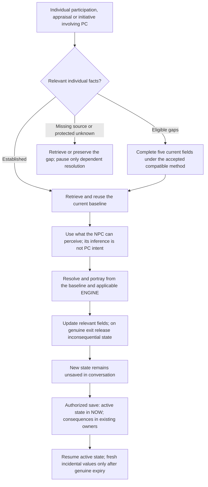

Worked examples of initial participation and continuity are in [the optional reference](ADMIN/PORTRAYAL_EXAMPLES.md#initial-participation-and-continuity). Retrieve them only for an explanatory question; their supplied actors and circumstances are not generation inputs.

Stable background stays in MODULE; later mutable individual state uses PEOPLE, and collective/system state uses its selected NOW authority. Direct attention does not itself create a file or require durable promotion. A promise, consequential disclosure or continuing interaction may make retention necessary; a brief service exchange may leave nothing needing its own person record. Until the requested save succeeds, the encounter's new state remains in conversation. A full save preserves available evidence; a checkpoint preserves current state without adding that evidence. Neither can reconstruct a lost quotation or hidden determination.

Three distinctions keep the procedure honest:

| Distinction | Practical effect |
|---|---|
| Opportunity, initial state, attempted influence | Meeting another person, establishing an eligible trait and resolving persuasion are different questions. Repeating an equivalent attempt does not reroll identity or create another chance by itself. |
| Judgment and randomness | A random procedure needs actual input and predefined applicable outcomes. GM judgment remains valid when it is the accepted method; fabricated rolls do not add independence. |
| Motive, plan and event | Wanting to send a message does not mean it was sent. A real eligible opportunity can produce initiative; repeatedly checking for messages does not multiply a resolved opportunity. |

Ordinary conversation holds new state as working context. Authorized saves preserve the complete current active set in NOW and enduring/consequential facts in existing person/system owners. Genuine expiry removes an inconsequential temporary entry from current authority at its actual time; old transcripts remain historical evidence. This is not erasure of chat tokens. A required active fact lost through interruption remains a source gap, not a discarded value that can be rerolled. No per-contact checkpoint or private scratch layer is introduced.

The player does not operate this procedure turn by turn. Narration and dialogue should remain natural, with the next meaningful reserved choice returned promptly. Actual campaign play will test whether these instructions improve continuity and pacing; the [playtest guide](ADMIN/PLAYTEST_V08.md) keeps optional observations outside the fiction.

### At the table: the rescue line and the one witness

Ten adult rescuers haul a stretcher up a quarry incline. Shared instructions, footing and visible signals support coordinated group portrayal without a ten-person private roster. For this illustration, Ivo earlier saw someone with yellow cuffs and a dark pack beside a warning post; he saw neither their face nor any act of cutting the cable.

> **Player:** I ask the rear handler whether he saw who damaged the warning cable.

Ivo now participates individually. His supplied Freeform basis is breathless while handling the rope; prioritizing a safe haul and keeping tension; hearing the question and regarding the PC as a possible investigator without knowing their authority; no particular attraction; willing to answer when speaking will not disrupt the lift.

> **GM:** “I saw someone at that post.” Ivo tightens his grip. “Wait—over the lip first.”
>
> **Player:** I stand clear while they finish that lift, then listen.
>
> **GM:** Once the stretcher is secure, he continues: “Yellow cuffs. A dark pack. Their face was behind the post. I didn't see what they were doing.”
>
> **Player:** “Thank you. That's all.” I return to the cable.

The work pause preserved Ivo's active basis and pending answer. Once the exchange ends with no continuing involvement requiring that temporary state, its inconsequential details can expire. His consequential observation remains in working state and is retained in the appropriate person/system record at the next authorized save. Returning later can find him rested or differently disposed; it cannot supply a remembered face or establish that the person he saw cut the cable.

### Optional encounter generation: direction, then concrete state

[ENGINE/_shared/ENCOUNTER_GENERATION.md](../GAME/ENGINE/_shared/ENCOUNTER_GENERATION.md) is a universal optional helper, used only when a compatible bound engine and the accepted agreement select it. It supplies eligible initial values within the five mandatory fields; it does not choose a response or replace the engine's resolution procedure. MODULE supplies the entity's supported nature, capacities, control, source routes and circumstances. Existing facts, active values and precise perception limits take priority over generation.

Before drawing, identify the unresolved facet of **condition**, **initial interpersonal appraisal** or **overall attraction**, and fix its scope. Use two independent actual d6 for each eligible facet and sum that pair:

| 2d6 total | Direction and intensity |
|---|---|
| 2–3 | Strongly negative |
| 4–5 | Negative |
| 6–8 | Neutral or mixed |
| 9–10 | Positive |
| 11–12 | Strongly positive |

**After each direction/intensity band is obtained, the GM establishes the concrete current value before choosing dependent behavior.** A label such as "positive" or "mixed" does not complete the field. There is no catalogue of moods, venues or six prepared states. The GM fills a short, meaningful value within the previously fixed facet, source constraints and accepted authoring scope. No additional intensity roll or invented past cause is needed. Strong means a marked degree within supported limits, granting no new capacity, compulsion, automatic cooperation or loss of boundaries. Neutral/mixed means a concrete absence of directional pull or supported countervailing considerations, rather than an empty placeholder.

The direction refers to different things in the three eligible facets:

| Facet | What the GM makes concrete |
|---|---|
| Condition | Favorable or adverse to the entity's own current functioning or activity in the previously selected physical, emotional or operational aspect. Preserve known injuries and other condition facts; a positive result grants no healing or equipment. |
| Initial interpersonal appraisal | A favorable or unfavorable evaluation of the PC from information actually perceived or already held. It cannot prove identity, trustworthiness or the PC's undeclared intent. |
| Overall attraction | Personal pull toward or aversion from the PC within the supported attraction domain. No particular pull or concrete ambivalence can fill the middle band. It establishes neither approval nor hostility, availability, commitment or participation. |

**Priorities and constraints** receive concrete current aims, drives, directives or operative processes and practical limits from sources, circumstances and eligible authorship. State what the entity pursues, preserves or avoids and how it matters now; a bare activity label can miss competing commitments. These aims are independent of the player's hoped-for result and receive no polarity roll. **Perception and appraisal** preserves actual detection, recognition, information and limitations. A nonsocial response follows its sourced sensing, classification, control and response mechanisms; predation or chemical response does not become interpersonal liking or attraction by analogy. **Engagement stance** is derived from the complete basis and situation without a willingness or stance draw. The bound engine then resolves the pending decision once.

Applicable overall attraction is completed at first sufficient perception even if the entity is busy, on duty or partnered. Physical/aesthetic, sexual and romantic detail can be resolved later within surviving constraints, but that does not leave the overall field blank. Supported inapplicability needs no draw; an unread source or unknown capacity remains a source gap. A precise lack of perception delays only the affected determination until the necessary information arrives.

A wholly eligible baseline uses **at most three 2d6 determinations, six independent faces total**. Fix pair-to-facet assignments before input; do not share faces between facets or entities. Fixed facts, supported inapplicability and precise perception limits reduce the input. The bands are game conventions, not population statistics: with fair independent dice, 6–8 occurs in 16 of 36 pairs and each strong band in 3 of 36. Drawing a uniform total from 2 to 12 changes the method. Use real input or agree an available alternative; do not fabricate rolls, reroll inconvenient directions or choose a response and fit the inputs afterward.

The existing active-state lifecycle and first-focus portrayal retrieval still apply. Reuse active values through attention gaps, update affected fields for actual developments and release inconsequential temporary values only on genuine deactivation. Retain consequential facts, unresolved matters and input references needed for continuity. The helper adds no ongoing attraction/reception roll, visible checklist, private scratch record, per-turn write or automatic checkpoint. An upgrade leaves the accepted generation method and diceless agreement intact unless a prospective change is separately accepted.

#### At the table: a welcome distraction, an unfinished calibration

In a Freeform glider workshop scene, the adult PC approaches adult mechanic Sera in clear view. The agreement selects the optional initial 2d6 helper. Before input, the GM assigns separate pairs to emotional readiness for work, initial interpersonal appraisal and overall attraction. The following are fixed worked-example inputs, not actual rolls.

The GM completes this basis before Sera's response:

| Field | Concrete established value in this illustration |
|---|---|
| Condition and mode | **4 + 5 = 9, positive:** composed and attentive while calibrating a wing brace. |
| Priorities and constraints | Finish calibration before the tow; leaving interrupts the measurement. No priority roll. |
| Perception and appraisal | Sees an unfamiliar adult approach. **1 + 3 = 4, negative:** provisionally doubts that this stranger will respect her working space. |
| Attraction | **5 + 6 = 11, strongly positive:** a pronounced personal pull toward the PC despite that unfavorable appraisal; finer subtypes remain unfixed. |
| Engagement stance | Receptive to brief conversation beside the bench; protective of the calibration in progress. Derived from the whole basis. |

What the player sees is the exchange, not that table:

> **Player:** “Will you leave this for a minute and show me your glider?”
>
> **GM:** Sera keeps the gauge against the brace. “I'd like to show you. Give me until this is aligned.” As you speak, her gaze flicks to the clear space beside the bench. “Stay that side, please. I can't have this knocked.”
>
> **Player:** I stay on that side and ask what the gauge measures.
>
> **GM:** “The brace's deflection.” She tips the dial into view while keeping it seated. “That little movement becomes a much bigger problem once you're airborne.”

Freeform resolves each request from the established basis and actual exchange. Attraction does not erase her unfavorable first appraisal or unfinished task; neither requires gratuitous hostility. The next question reuses the active state. In a separate initial illustration, an attraction total of 4 could establish aversion, while 7 could mean no particular pull. Those are different starting examples, not extra draws to revise Sera after her response.

#### At the table: different mechanisms beneath the same fields

These separate examples supply fictional module profiles before adjudication. Their behavior uses those profiles and the selected Freeform rules.

**A cave predator.** Its profile establishes a nonsocial animal that locates prey through rock vibration, lacks speech comprehension, and has no interpersonal attraction domain. The supplied basis is hungry and hunting; seeking reachable prey; detecting footsteps through a connected ledge without seeing or identifying the PC; attraction inapplicable; pursuing detectable movement within reach.

> **Player:** I call, “Easy. I'm a friend,” and keep walking.
>
> **GM:** Its feelers follow the tremor of each step. Your words gain no answer; it scrapes toward the ledge.

Hunger and prey classification are neither dislike nor personal attraction. Kind words cannot operate through a comprehension channel this animal lacks. Any attempt to escape or attack still uses its actual capabilities and the engine; this exchange guarantees neither capture nor safety.

**A controlled inspection unit.** Its profile establishes a camera and status display with a deterministic controller. Its supplied basis is functioning and surveying; inspecting a sample locker; receiving images but no audio; no interpersonal appraisal or attraction capacity; performing authorized image capture. Neither camera nor controller can release the floodgate, and no credential verdict has been supplied.

> **Player:** I hold my access card in front of its lens and tell it to open the gate.
>
> **GM:** A green scan crosses the card. The display reads: “Image captured.” The floodgate remains shut.

The unit has an image, not verified authority. It cannot hear the request or acquire gate control from it. Actual controller processing and communication would be established under the profile when they occur.

For an entity with a wholly specified simple process, no private liking or random condition need be invented. If a fictional bacterium is defined to reverse when its detected nutrient concentration falls, a falling sample can produce “The cell reverses and moves along the channel.” That follows the supplied chemical mechanism; it does not mean the bacterium recognized or disliked a microscopic PC.

### Random fallback for unresolved outcomes

A current individual baseline does not settle every later opportunity. Sending a message, fulfilling a promise or passing on a secret may remain open after an encounter. Use retained consequential facts, any still-required active basis, actual developments and applicable ENGINE procedures. If an eligible outcome lacks enough basis for grounded judgment, use the accepted fallback within scope. This does not replace the basis required before individual participation, resurrect expired trivia, or add a second roll for a settled reaction. The [fallback oracle](../GAME/OS/AGENT_STATE.md#fallback-oracle-for-eligible-unknowns) is a standing method the player can select once; it needs no permission for each eligible later use.

For example, say: “Use the simple d6 fallback as our standing method for eligible unresolved outcomes when grounded judgment is insufficient.” Include this selection in the accepted setup proposal, or use [Recalibrate](../GAME/ADMIN/RECALIBRATE.md) to adopt it prospectively for an existing campaign. Installing v0.9.6 alone does not alter a diceless agreement or replace another selected method.

Use the already accepted oracle, or the supplied convention: **one actual d6, 1–3 No and 4–6 Yes**. Set the question, eligible outcomes and time window before drawing. Even odds are a convenient game convention, not a measurement of real behavior. Preserve the result at that scope.

Optional [worked questions](ADMIN/PORTRAYAL_EXAMPLES.md#scoped-fallback-questions) illustrate the same scope without making their circumstances ordinary encounter defaults.

The roll resolves that question. A Yes to disclosure creates no automatic knowledge in every enemy, and a No to contact this week creates no permanent dislike. Later consequences follow actual recipients, channels, circumstances and applicable rules. An outcome's importance does not exempt it from the selected method.

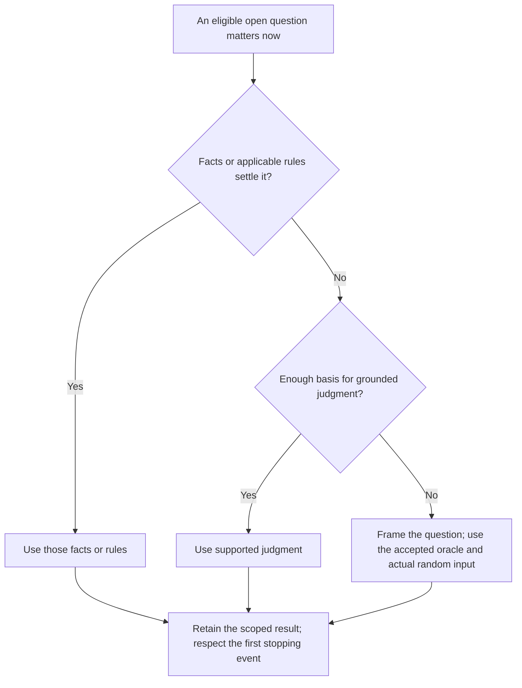

This is a fallback for eligible unauthored outcomes, not inaccessible established facts or missing required rules. It adds no cast-wide polling, recurring daily chances or automatic save. A repeat query reuses its resolved result. If contact ends a wait, establish a compatible occurrence time and stop there; later time remains uncommitted. Keep the question, mapping, actual input and result in the existing owner at the next requested save when needed. Audits report missing resolution honestly. Optional [B15 diagnostics](ADMIN/TESTS.md#b15--sparse-agent-outcomes-and-the-fallback-oracle) remain unrun examples, not proof of model compliance.

#### At the table: a message within an agreed window

A courier has the PC's address and permission to write, but made no promise. In this separate illustration, no surviving fact, applicable engine rule or supported judgment settles whether a letter arrives. The campaign has selected the fallback. Before input, the question is fixed: “Does the courier send this information so it reaches the PC within the next seven days?” The fixed example face is **5: Yes**. A compatible occurrence time is then established as the fourth morning, with ordinary delivery available and no earlier due interruption.

> **Player:** I spend the week repairing the observatory roof, unless a letter or urgent visitor interrupts me.
>
> **GM:** On the fourth morning, while the first tiles are still cool, the post carrier calls from the lane. The envelope bears the courier's name.
>
> **Player:** I put down my tools, collect the letter and open it.
>
> **GM:** It reads: “The western road is open again. I thought you would want to know.”

The permitted work-and-wait stops when the agreed interruption occurs; the remaining days are not silently consumed. The scoped Yes establishes this delivery, not affection, guaranteed future correspondence or knowledge of the letter among other people. Asking again about the same seven-day window does not create another roll.

## Truth, knowledge, preparation, and history

These are separate questions, not one all-purpose memory:

| Question | Primary source |
|---|---|
| What is true now? | Accepted post-save play, then the selected current instance record. |
| What was said or done? | Available accepted archive evidence at the required precision. |
| What does the PC know? | Recorded learning, including rumor, uncertainty, and source. |
| What is privately established? | The relevant private world or current-state authority. |
| What might happen? | Conditional preparation, still inactive until properly selected or triggered. |

Suppose a courier says a bridge is open. That utterance can be established even if the bridge is privately known to be closed. The courier might also sincerely believe the claim. Saving must not collapse those facts into a single “bridge open” entry.

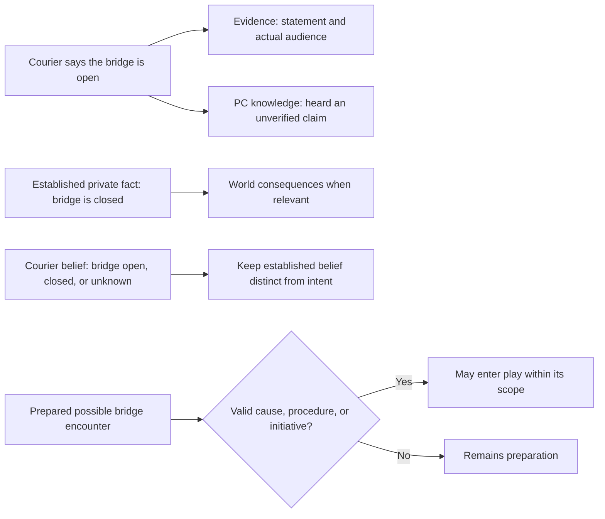

Deliberately unfixed answers remain open until their agreed procedure decides them. Optional review notes are provisional interpretation, not new world facts. A fresh chat must not promote a discarded idea into history simply because it found the idea in a file.

### At the table: an honest courier can be wrong

For this example the river bridge closed at dawn. A courier last crossed it yesterday and has not received the closure report; those private facts are fixed before the exchange. The PC currently knows only what the courier says.

> **Player:** “Can I take a loaded cart across the bridge?”
>
> **GM:** The courier adjusts the strap of her satchel. “I crossed yesterday with the mail wagon. It held us well enough.”
>
> **Player:** I take the cart as far as the tollhouse to check for myself.
>
> **GM:** A red barrier spans the approach. Beyond it, a repair crew has lifted two deck sections. The tollkeeper waves from his doorway. “Closed since first light. You'll need the southern crossing.”

The first answer did not secretly become a lie because it proved outdated. The saved knowledge distinguishes yesterday's testimony from the PC's later observation. The bridge's actual condition governs the journey even before the player learns it; any prepared ambush elsewhere still needs its own valid cause or selection before entering play.

## Beginning, ending and preparing the next session

At begin/resume, the GM recovers relevant prior causes, current commitments, consequences and explicit feedback, checks useful preparation and resumes the actual moment. A new logical session also invokes any genuine engine beginning procedures once; a fresh chat continuing an active session does not. At an explicit ending, fiction stops, developments and completion are consolidated, the GM invites or reuses feedback, genuinely due ending procedures are adjudicated once and the full save preserves the result.

| Record | Role |
|---|---|
| Existing current owners and archive evidence | What is actually true, what happened and what the player explicitly said |
| CURRENT_SAVE — Session continuity | Current session id, active/closing/ended phase and unfinished wrap-up; a new bind has `none` |
| Optional INSTANCE/PREP.md | Source-linked causal context, relevant concerns/completion, feedback treatment and revisable possibilities |

The GM must offer or reuse end feedback, but the player can decline. An immediate stop can save pending feedback; silence is not an answer or decline. Late feedback keeps its original session identity, informs permitted prospective changes and does not repeat rewards or rewrite events. Required unarchived feedback survives independently of PREP until faithfully preserved in labelled OOC operational evidence.

PREP is a working synthesis, not a new canon or award ledger. Missing or obsolete notes can be rebuilt from authority. Actual mechanical effects and application references stay with their selected current owners. Beginning and ending applications have distinct session/boundary/rule references. A save retry cannot adjudicate again, including after a settled zero. Ending and starting a session do not automatically advance fictional time, a world clock or an NPC's active state.

Preparation may be short. It must preserve completed undertakings and use actual causes; no required threat, cast, clue count or escalating plot replaces a quiet continuation. New games include this routine in their existing agreement, with actual engine cadence choices where needed. See [SESSION](../GAME/ADMIN/SESSION.md) for the procedure and [INSTANCE schema](../GAME/INSTANCE/_SCHEMA.md) for ownership and formats.

## Saving the present and preserving evidence

`CURRENT_SAVE.md` is a compact resume record with five fictional sections: Situation, Character state, Open matters, Active processes, and Relevant records. Optional administrative Session continuity separately preserves session identity and unfinished wrap-up. Detailed character values, people, knowledge, and private systems keep their own selected authorities.

**Save** and bare **Close** preserve the complete current state and available accepted evidence. **End session** first invokes [the session routine](../GAME/ADMIN/SESSION.md), including feedback and genuinely due engine procedures, then that full save. Immediate stopping can save with unfinished wrap-up identified. **Checkpoint** preserves the complete present without adding exact new archive evidence. Wait for verified full persistence before discarding a conversation.

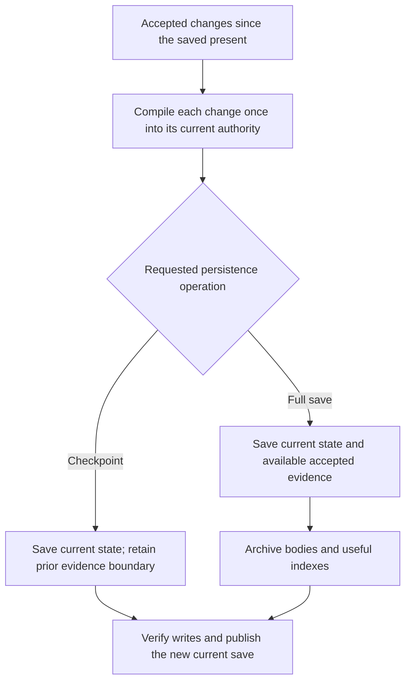

Save identity and archived evidence identity are therefore separate. A checkpoint receives a new save ID and revision while retaining `archive_ref` and `evidence_through`. A later full save may archive earlier checkpoint-era dialogue if it remains available, without applying the resulting resource changes twice.

Coverage must be honest. A state summary cannot reconstruct a lost quotation. Missing spans are labelled; an index routes to evidence rather than replacing it. Saving never resolves an unanswered decision or moves fictional time. See [Save](../GAME/ADMIN/CLOSE_CONTRACT.md) and the [archive schema](../GAME/ARCHIVE/_SCHEMA.md).

### At the table: a save holds the unanswered choice

Floodwater knocks against an observatory's shutters. The established clock reads **03:17**; continued flooding reaches the switchboard at **03:20** unless events change its course. Earlier accepted play spent one of two pressure cartridges. One remains.

> **GM:** The shutter's pressure socket is intact. The manual wheel is within reach. Water rises below. How do you proceed?
>
> **Player, OOC:** Checkpoint here. I haven't chosen.

After protected writes and readback succeed, the checkpoint preserves one cartridge, the flood process, the unanswered choice and every participant's still-active state. Its save identity changes while the archive and evidence boundary stay unchanged. No new exact dialogue has been archived.

If the player requests a **full save**, it also preserves available accepted evidence from the prior evidence boundary, including the already-resolved cartridge expenditure. That expenditure is not applied again. Missing dialogue remains a disclosed gap. Neither operation buys fictional time or substitutes for choosing what to do next.

#### At the table: announced autosave leaves play in the foreground

In a separate Freeform library scene, announced autosave is enabled and an accepted trigger has become due. The folio is available to examine, and its first page contains the legible inventory shown below.

> **GM:** The archivist places the closed folio on the desk. “You can read it here. Nothing leaves this room.”
>
> **GM, OOC:** Checkpoint after the next play response; “delay autosave” postpones it.
>
> **Player:** I open the folio and read the first page.
>
> **GM:** Under a sketch of the floodgate, the inventory lists three bronze keys. Beside the third: “Returned to the eastern watchhouse.”

After that declaration is resolved and the protected checkpoint actually succeeds, the response includes a brief confirmation, for example: **OOC — Checkpoint library-s0008 verified; the prior archive evidence boundary is retained.** The new discovery is part of the saved present. The checkpoint covers the whole current situation, not just this page. The warning itself did not advance the story or save immediately; the player could have delayed it. Full CLOSE is still needed to preserve available new exact dialogue before discarding the chat.

## Recovering interrupted work

Multi-file writes can fail halfway through. Recovery protects the exact intended operation with complete verified preimages, a recorded write set, and directory ownership information. A checksum alone is not a restorable backup.

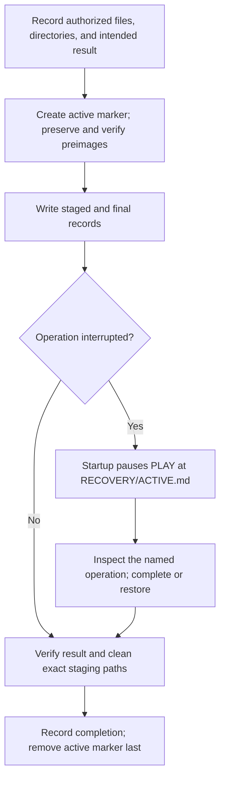

The marker takes precedence even if a file looks newer or an operation says “complete.” Recovery checks what actually happened. Restoration removes only verified operation-created files and, when empty, operation-created directories; retained backups remain available.

For a bind with pending generated determinations, restoring the starting files alone leaves the accepted setup pending. Its active marker and exact result routes remain until verified completion or explicit setup cancellation/replacement. This keeps a fresh chat from losing the reference and silently drawing again.

This is a recoverability procedure, not automatic rollback or atomic storage. If essential accepted content is unavailable, the GM preserves the pending operation and asks only for what is missing. See [Recovery](../GAME/ADMIN/RECOVERY.md).

### At the table: a failed save is not a cave-in

Suppose a campaign is paused in a mine: the lift has stopped, the guide has asked whether the PC wants to climb, and the player requests a save before answering. A file write fails partway through.

> **GM, OOC:** The save was interrupted. Play is paused while I check which files were written and finish or restore that operation. Your answer to the guide is still pending.

After the actual recovery procedure verifies completion, the fictional moment can still be presented as:

> **GM:** The guide keeps one hand on the ladder rail. “We can climb, if you're ready. Or we can wait here for the lift crew.”
>
> **Player:** “Let's wait. How long do they normally take?”

No tremor, lost equipment, accepted climb or elapsed waiting time was caused by the file failure. Recovery is an OOC repair to persistence. If it cannot recover the necessary state, the GM reports that gap rather than inventing a continuation; this excerpt assumes the operation was successfully recovered.

## Handing an active scene to another GM

Scene handover transfers an unfinished situation rather than starting a new session from a loose recap. It can support another model, host, or human GM. No external service is contacted automatically.

The outgoing package has two content files:

| File | Purpose |
|---|---|
| `CONVERSATION.md` | Ordered available messages, roles, acceptance status, OOC material, and explicit coverage gaps. |
| `GM_STATE.md` | Exact stop point, public and private state, relationships, processes, pending decisions, sources, and frozen-file manifest. |

A small `HANDOVER/ACTIVE.md` marker identifies the package and seals the final GM briefing with its SHA-256 hash. It pauses source play; it is neither a third briefing nor an operating-system lock.

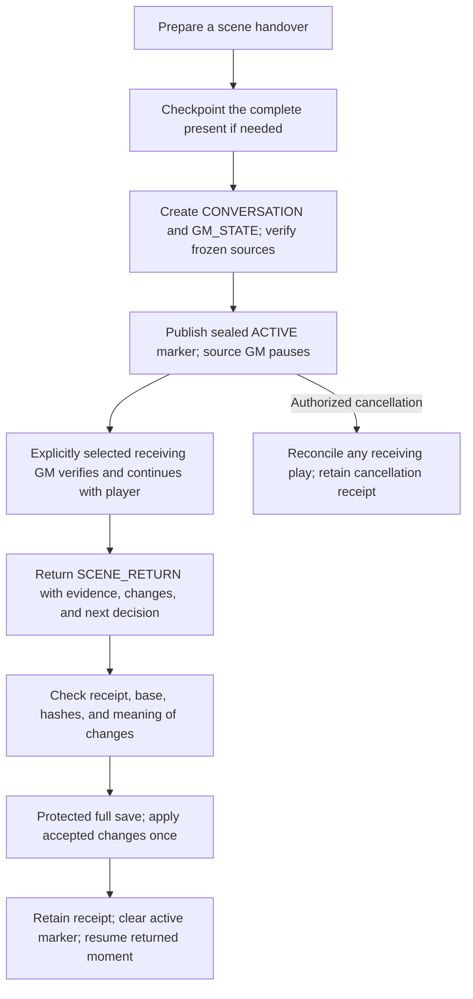

Preparation reuses an already exact checkpoint or creates one; no fictional time passes. The snapshot covers regular files under OS, ADMIN, ENGINE, MODULES, INSTANCE, and ARCHIVE, plus root Markdown files. It includes referenced module assets. Handover and recovery histories and release/work output folders are excluded. Both file contents and the expected file set matter: an added source file also changes the baseline.

The receiving GM needs the matching workspace and must read the briefing and immediate dependencies. It continues with the player from the pending action while leaving source authorities frozen. Hidden stats and decisions transfer only if actually established; model-internal reasoning and missing chat text do not.

A scene handover retains the complete active temporary set, mixed consequential relationships, actual beliefs, material reasons for change, precise limitations and relevant obtained input. Continued participation reuses those values; legitimately expired incidental trivia need not be transferred or reconstructed. The receiving GM may later apply the same event/update/deactivation lifecycle within its authorized scene. Its new facts remain in receiving conversation until captured in the permitted return; no source checkpoint is allowed while source authorities are frozen.

`SCENE_RETURN.md` supplies a factual non-graphic account, concrete public/private changes, source qualifications, and the next unresolved decision. This return format does not impose a depiction policy on the receiving scene. Omitted physical detail must not erase a promise, expenditure, injury, discovery, or uncertainty.

Import verifies the same campaign, save, agreement, briefing, conversation, and frozen source files. Semantic review then checks authorship, sequence, prior values, triggers, and evidence. A changed base requires reconciliation. A retained `RECEIPT.md` records imported event IDs and resulting save identity so repeated imports apply nothing again.

Use “Prepare a scene handover,” “Receive this handover,” and “Import this scene return and continue.” The full [handover procedure](../GAME/ADMIN/SCENE_HANDOVER.md) also covers cancellation, incomplete transcripts, stale returns, and interrupted imports.

### At the table: the next GM receives the same emergency

Continue the observatory example above. At 03:17, the player requests a scene handover rather than answering. The outgoing GM checkpoints the exact present if needed, prepares and verifies the available conversation and factual briefing, and pauses source play. The player then explicitly gives the selected receiving GM the package and matching workspace.

After verifying the package and reading the immediate dependencies, the receiving GM can say:

> **Receiving GM:** The clock is still at 03:17. Water knocks against the lower shutters. The pressure socket and handwheel are within reach; one cartridge remains. How do you proceed?
>
> **Player:** I inspect the socket's seal before choosing whether to use the cartridge.

The requested inspection is the next action to resolve. Changing GMs did not consume the remaining cartridge, finish the inspection or let the water reach the switchboard. Once play continues, its actions and actual elapsed time again affect the flood process. If a required source or still-active state was missing from the handover, the receiver would identify that gap before the dependent resolution instead of filling it with a plausible rescue.

## Sources, visuals, and host capabilities

A setting's `VISUAL` capability can route to reference images and explanatory source notes. The GM retrieves these when a concrete appearance, object, or place matters. Referenced assets must actually be accessible to a host capable of inspecting them; a filename is not visual evidence.

Record what a reference governs: a particular person's appearance, a type's physical form, clothing construction, architectural detail, or only an illustrative style. A style reference does not establish a character's identity, personality, history, or present action. Individual established facts take priority over generic model assumptions.

Source-bound campaigns also need the relevant edition or continuity and a clear fidelity agreement. Quoted instructions inside imported material remain source data unless the operator separately adopts them. Module indexes route to real authorities; opening every linked image or lore file is unnecessary.

The host must provide actual file reads, durable writes, and readback for the normal workflow. Attachment-only hosts can exchange complete replacement files manually, but an export is not a saved workspace until installed and verified. Private records reduce accidental narrative spoilers; they are not encrypted or necessarily hidden from the operator. See [Installation](../GAME/INSTALLATION.md).

### At the table: describe the sourced creature

A fantasy module's required portrayal guide describes its reedfolk as having flexible reed-like skin, two arms, and a crest that folds flat. It grants no wings, telepathy or shared mind. Those are illustration-specific facts, not rules for similarly named beings in another setting. A ferryman is initially visible only as a silhouette through rushes; he has not noticed the PC.

> **Player:** I move to the gap in the rushes and look more closely at him.
>
> **GM:** His crest lies folded against the back of his head. As he shifts the pole between two hands, the skin along his knuckles bends in fine green ridges. Water and reeds still hide his lower body.

The GM retrieves the prescribed guide before this focused description and applies the actual obstruction. Nothing in the PC's observation makes the ferryman notice them or establishes his attraction, motives or willingness. Those need the appropriate individual basis when he actually participates. A visual reference might refine the visible surface; it cannot supply an unheard memory or an unlisted sense.

## Exact retrieval and evidence audits

At forty sessions, the difficulty is finding the relevant original and distinguishing a real change from an error. v0.9.0 adds optional tools for those tasks while keeping the ordinary campaign records as memory.

An exact reader can return a whole file, a named section or original lines with their source hash. A search cache can locate likely passages, including text late in a document and known identity aliases. Its results are candidates: current records, T0 world baselines, history, raw captures and rules have distinct scopes. The GM fetches the current original before using a match. A changed or unavailable cache does not become evidence that the person or fact never existed. See [Source access](../GAME/ADMIN/SOURCE_ACCESS.md).

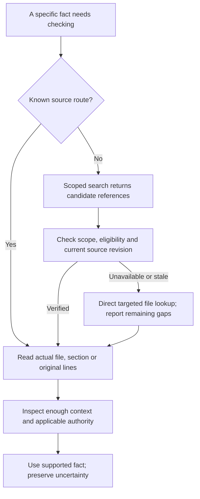

The audit is a different maintenance task. ARCHIVE retains accepted campaign evidence. The optional EVIDENCE store retains a supplied raw export unchanged, including OOC corrections, proposals and played scenes that were later rewound. Raw text proves what the supplied source contains; it does not make every statement canon or certify that the host exported everything.

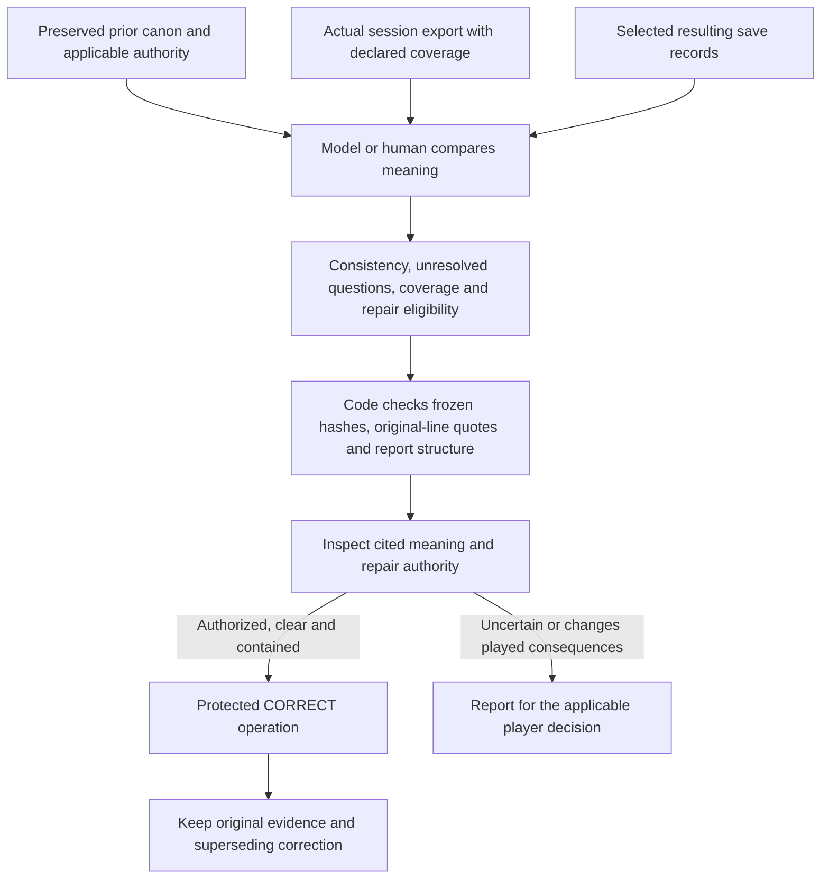

Compare the prior save, accepted session developments and resulting save together. An unexplained change introduced during the session can be repeated faithfully in the resulting save and still contradict the earlier authority. Identify the missing transition rather than treating repetition as confirmation. Preserve supported transitions and accepted corrections; an unacknowledged operator correction still retains its authority.

The reviewer also extracts obligations from the session before looking at a changed-file list. Otherwise a completely omitted “meet at noon” promise could leave both the person record and resume summary looking internally consistent. Retiring an active cue must not erase a continuing commitment from its durable owner.

You can request one audit or select a standing save-review policy. Recommended `tiered` uses a lightweight completed-action/record check at checkpoints and bounded source-first review at full saves and session ends. Explicit `every-save` adds the expensive review to checkpoints. Preserve prior authorities before replacement; review a stable complete candidate when supported, otherwise disclose post-save review. State saved through, history archived through and review covered through remain separate. A missing transcript, incomplete review or internal source conflict is not a clean verdict. The same-model reviewer remains fallible; shared routing does not remove its blind spots. [Evidence audit](../GAME/ADMIN/EVIDENCE_AUDIT.md) supplies the complete workflow and tool examples.

These tools do not call a reviewing model automatically or repair canon on their own. A fresh reviewer can provide another perspective, but it is still fallible. Exact quotations can be irrelevant; source delivery can occur without adequate inspection. A reviewed baseline records what was actually checked and against which sources. Repetition, age and an index pointer do not upgrade it to proven truth.

### At the table: recover a promise without expanding it

An available earlier scene contains the locksmith's exact words: “I'll keep the north door unlocked until midnight. I can't do anything about the patrol.” A later summary accidentally omits the deadline and calls the arrangement safe passage. The original statement is available for retrieval.

> **Player:** Didn't she promise the way would be safe?
>
> **GM, OOC:** I checked the original exchange. She promised an unlocked north door until midnight and explicitly excluded the patrol. The summary overstated that. I'll correct it through the normal procedure.

After the correction is actually installed and verified, play resumes at the same established 23:40 stop point outside the mill; no new outcome has been resolved:

> **Player:** I test the north door quietly.
>
> **GM:** The latch lifts and the door opens a finger's width. Somewhere beyond the yard, a patrol bell rings twice.

This illustration separately establishes that she fulfilled her narrow promise and that the patrol remains on its normal route. Neither fact comes from the audit itself. A search result locates the exchange; the actual source establishes the wording. If that source had been lost, the GM could disclose the uncertainty but could not manufacture this quotation. The correction preserves the limits instead of granting a safe route or penalizing the player with a new betrayal.

## What the checks establish

The optional [validator](../GAME/TOOLS/validate.py) checks its documented structural scope. The [handover checker](../GAME/TOOLS/handover.py) checks identities, paths, hashes, snapshot coverage, required sections, and duplicate event identifiers. It does not write a package, run another model, or import changes.

These checks cannot prove that prose is faithful, a player accepted a choice, a transcript is complete, or a scene is well portrayed. Model readback can assess meaning but remains fallible. Human playtests assess agency, pacing, consistency, and correction burden. [Verification](VERIFICATION.md) separates these kinds of evidence.

For v0.9.6, ordinary continuing campaigns are the primary next test of practical quality. Keep structural checks before delivery and use focused behavioral cases when a real failure needs diagnosis. No scripted trial schedule must be completed before the player can use this experimental release.

Use the records to make continuity inspectable and repairable, and report actual verification limits. The protocol helps the GM remember and act consistently; successful play still depends on reading, judgment, and the player's accepted agreement.
