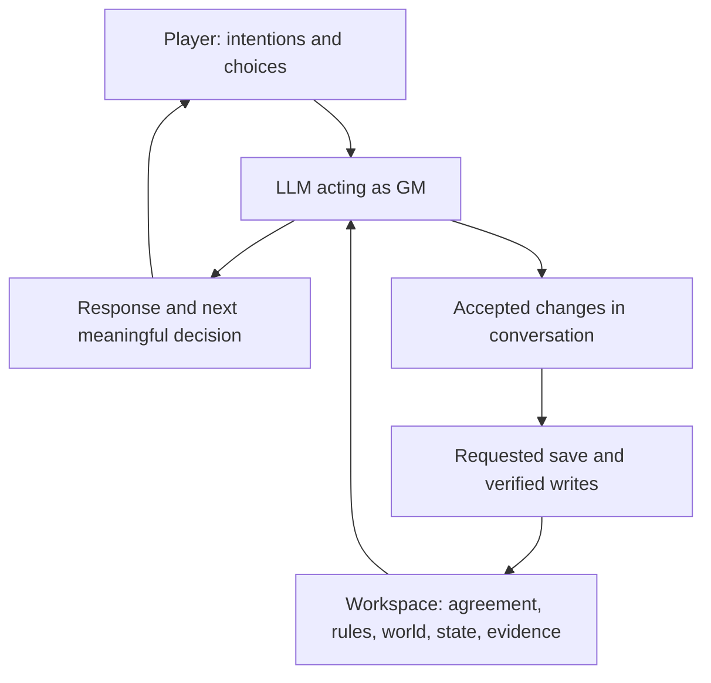
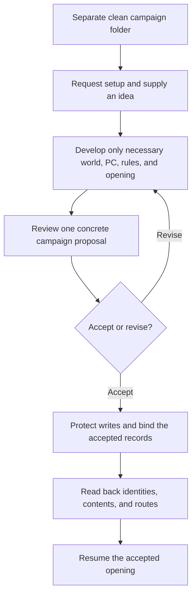
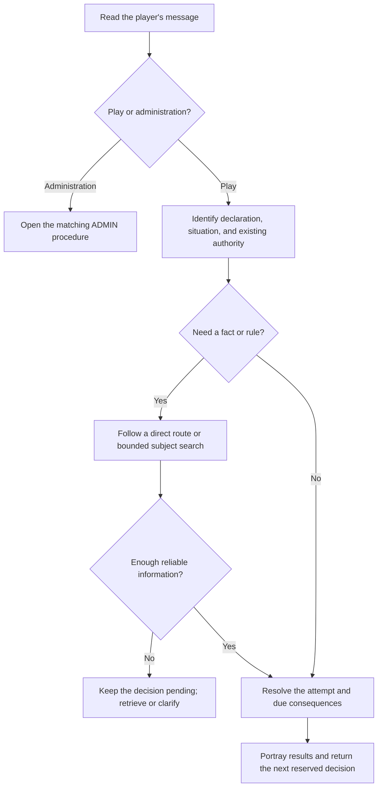
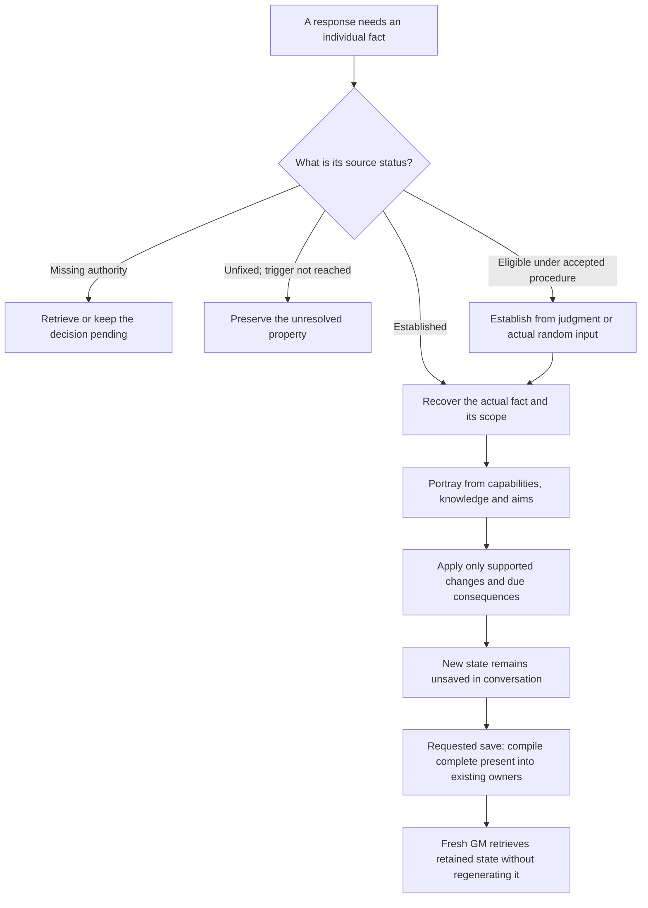
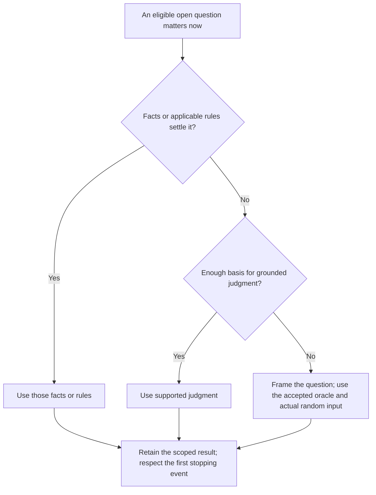
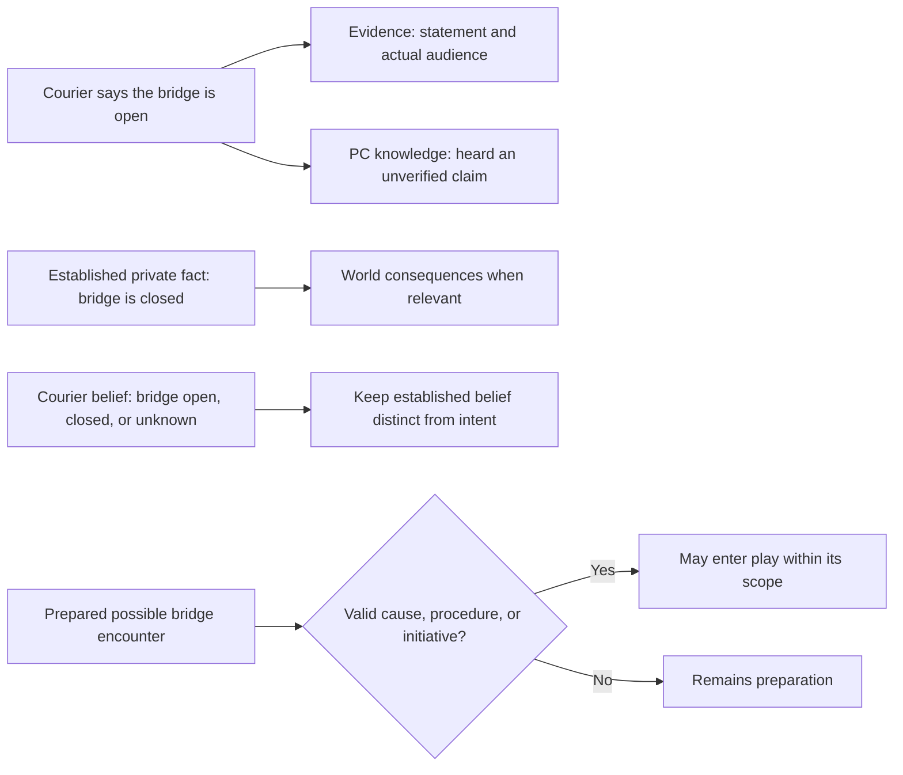
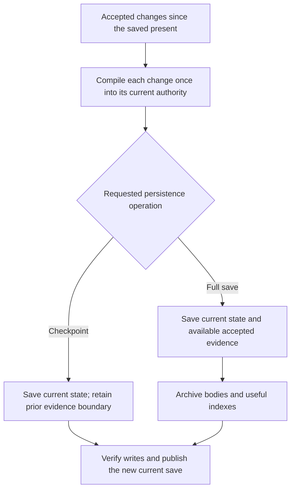
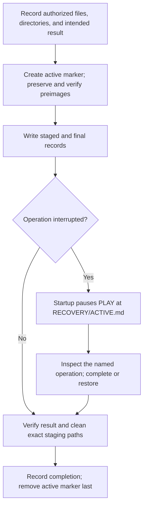
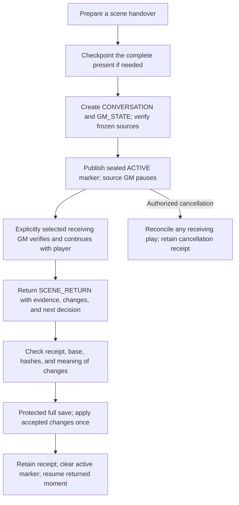

# How RPG OS works

RPG OS v0.8.1 is an experimental file protocol for running a roleplaying campaign with an LLM. The model portrays the world and adjudicates play; readable Markdown records preserve the agreement, present state, rules, and evidence needed to continue across chats.

It is not a trained model, background server, autonomous simulation, or replacement for a rules engine. Its procedures tell a capable host how to use ordinary files. The model still has to read the right source, make sound judgments, and perform the agreed operations correctly.

This guide explains the mechanics behind [Quick start](QUICKSTART.md). For compact technical ownership notes, see [Architecture](ARCHITECTURE.md); the linked operating files contain the full procedures.

## Contents

- [The operating loop](#the-operating-loop)
- [What lives where](#what-lives-where)
- [From fresh install to campaign](#from-fresh-install-to-campaign)
- [The agreement and authorship](#the-agreement-and-authorship)
- [Inside a turn](#inside-a-turn)
- [Independent people and other agents](#independent-people-and-other-agents)
- [Random fallback for unresolved outcomes](#random-fallback-for-unresolved-outcomes)
- [Truth, knowledge, preparation, and history](#truth-knowledge-preparation-and-history)
- [Saving the present and preserving evidence](#saving-the-present-and-preserving-evidence)
- [Recovering interrupted work](#recovering-interrupted-work)
- [Handing an active scene to another GM](#handing-an-active-scene-to-another-gm)
- [Sources, visuals, and host capabilities](#sources-visuals-and-host-capabilities)
- [What the checks establish](#what-the-checks-establish)

## The operating loop

The player supplies intentions and choices. The GM combines those with the accepted agreement, relevant records, and resolution rules. Accepted developments remain in the conversation until a save operation installs them in the workspace.



Conversation supplies temporary working context. Files supply durable, inspectable records. Merely mentioning a change does not establish that it was saved, and the existence of a file does not mean its contents are loaded into the model.

## What lives where

The fresh kit contains generic instructions and empty run templates. Campaign-specific records appear only through accepted setup and play. The tree below shows the main installed areas and the optional runtime areas created when needed.

```text
RPG_OS/
|-- OS/                    GM core, startup, targeted retrieval
|   `-- AGENT_STATE.md     Cold establishment and portrayal procedure
|-- ADMIN/                 Setup, saves, corrections, recovery, handover
|-- ENGINE/
|   |-- _CONTRACT.md       Adapter requirements
|   `-- freeform.md        Available judgment-based rules adapter
|-- MODULES/               Contracts; accepted worlds are added here
|-- INSTANCE/
|   |-- CURRENT_SAVE.md    Compact present and useful routes
|   |-- CAMPAIGN_CONTRACT.md
|   |-- CHAR/              Current character records after binding
|   |-- PEOPLE/            Current recurring-person records when needed
|   |-- KNOWN.md           What the played perspective has learned
|   |-- NOW.md             Current private and system state
|   `-- ...                Safety, corrections, routing, optional review
|-- ARCHIVE/               Indexes and accepted historical evidence
|-- TOOLS/                 Optional read-only checkers and tests
|-- RECOVERY/              Created for protected file operations
`-- HANDOVER/              Created for an authorized live-scene transfer
```

A module contains stable world material and an opening baseline. An instance is one actual run through that material. Later mutable values belong in the instance, while unchanged world background remains in the module. Archives preserve what happened rather than competing with the current records over what is true now.

The layout does not require an encyclopedia or a file for every passing character. Records split when their subjects need independent retrieval. See the [module contract](MODULES/_CONTRACT.md) and [instance schema](INSTANCE/_SCHEMA.md).

## From fresh install to campaign

The public installation is **unbound**: no selected world, character, campaign history, or active handover. Freeform is available, but setup still establishes the chosen engine. Unbound describes installation state; it does not select a play style or override a host's capabilities.

Start with:

> Open OS/AGENTS.md. Start a new campaign with me using Quick start.

Quick start, Guided, and Detailed change the depth of the setup conversation. They are not different runtime engines. Quick start asks only what materially blocks a coherent proposal; supplied facts and deliberate unknowns remain useful.



Binding gives the run its own campaign identity, save lineage, agreement identity, current PC bundle, and opening state. New Game does not clear a previous campaign to make room. Use a separate clean copy for another run.

Freeform uses established capabilities, circumstances, opposition, and stakes to judge uncertainty. It imposes no attribute list, compulsory dice system, or hidden stat block. A requested random method needs agreed meanings and an actual available randomizer or player-supplied result. More formal engines can be installed through the [adapter procedure](ADMIN/ADD_ENGINE.md).

## The agreement and authorship

The accepted [campaign contract](INSTANCE/CAMPAIGN_CONTRACT.md) turns preferences into concrete operating terms. Its five named clauses answer different questions:

| Clause | What it establishes |
|---|---|
| **Play form** | The accepted experience: exploration, missions, everyday life, directed chapters, or a described combination. |
| **Form selection** | Whether the GM may select a form, and the limits of that delegation. |
| **Structure disclosure** | What the player knows about the overall structure; plot secrets alone do not authorize concealing the form. |
| **Cuts** | Which transitions may compress or skip time, with meaningful reserved decisions preserved. |
| **Retcon** | Whether valid accepted outcomes may be rewound; genuine error correction remains a separate operation. |

The player controls the PC's voluntary actions, speech, inner experience, and commitments except for explicitly delegated scope. A biography, previous choice, or inferred preference grants no additional authority. The GM controls NPCs and world consequences within the agreement.

Initiative is meaningful without being compulsory incident generation. An established cause, applicable procedure, explicit request, or accepted initiative grant must justify a new consequential development before it is drafted. Permission to introduce trouble does not mean every scene owes trouble.

For example, permission to compress ordinary ferry travel can cover the declared crossing. It does not automatically choose whether the PC accepts a job offered aboard. [LAW](OS/LAW.md) defines these authorship and continuation rules; [Recalibrate](ADMIN/RECALIBRATE.md) changes accepted terms prospectively.

## Inside a turn

Startup checks recovery first, then loads the core, current save, and accepted contract. An active handover pauses source play. A bound run also reads its compact setting brief and any active operator limits; detailed lore and mechanics stay available for targeted retrieval.



Retrieval asks what could materially change this response. Exact equipment needs the current character record. A disputed promise needs its evidence body. Ordinary conversation may need neither. Direct pointers can be followed immediately; an index is useful when the route is unclear.

Private processes advance when their recorded triggers apply. Reading a storm clock does not move it. Saving does not make the storm arrive. A time-based process advances because relevant time elapsed, while another process may depend on a specific event instead.

The [retrieval guide](OS/RETRIEVAL.md) preserves these distinctions. It also prohibits filling missing historical wording or exact values with plausible guesses.

## Independent people and other agents

An agent's relevant state gives the GM a basis for its decisions: what it can do, what it believes, what it wants and how it currently regards the matter at hand. People, creatures, machines and collectives need different kinds of description. There is no universal list of emotions or a numerical relationship meter.

“Agent” means one of these fictional actors, including a decision-making system. The same GM portrays them through selectively retrieved facts; there are no separate AI workers running each NPC or continuously simulating the whole cast.

The GM first uses established facts. A deliberately unfixed property follows its agreed trigger. A missing source is a retrieval problem, not permission to invent a convenient answer. Only an eligible new detail is established through the accepted procedure before it affects a consequential response. The [cold agent-state procedure](OS/AGENT_STATE.md) supplies this detail when needed; it is not another file loaded at every startup.



### Example: a coworker, a mistaken belief, and a fresh GM

In this illustrative station scene, coworker Mara values safe maintenance. She trusts the PC's technical skill, doubts their thoroughness, and keeps a personal distance. A service hatch is actually open, but Mara believes it is sealed because she read an outdated log. Her mistaken belief and the hatch's true condition are separate established facts.

| Stage | What happens and what remains true |
|---|---|
| **Before the encounter** | The opening records establish Mara's mixed relationship and mistaken belief. The GM can portray courteous, cautious cooperation. Neither the PC's wish for friendship nor Mara's wrong information changes the hatch's actual condition. |
| **A relevant event** | The player declares that the PC inspects the hatch and shows Mara the open latch. Mara looks and acknowledges the discrepancy. Direct observation changes her belief; this careful check gives her a reason to trust the PC's thoroughness more. Her personal distance remains unchanged. |
| **The player requests a full save** | The complete relevant current relationship and belief, with their cause, go into Mara's person record. The PC's observation goes into KNOWN. Available declarations and dialogue go into ARCHIVE. The unchanged hatch fact keeps its existing world owner; the save's useful pointers locate current records. No additional action or attitude change occurs during saving. |
| **A fresh GM resumes** | The new GM retrieves Mara's current record: greater professional trust, continued personal distance, and knowledge that the hatch is open. It does not replay the discovery, restore her old belief, or infer friendship. A later request for help is judged from these facts and the actual circumstances. |

The valid change is as important as the continuity. Ignoring the observation would make Mara rigid; turning a careful inspection into universal affection would erase the distinction between professional trust and personal closeness. Ordinary help or initiative can be appropriate without manufacturing an obstacle.

This example uses established facts and Freeform judgment, so it requires no random draw. If an eligible unknown instead uses a selected random procedure, its context and outcome meanings must be settled before obtaining real input. The result is then retained at its actual scope; repeated attempts or a new GM do not authorize another draw.

Stable background stays in MODULE; later mutable individual state uses PEOPLE, and collective/system state uses its selected NOW authority. Until the requested save succeeds, the encounter's new state remains in conversation. A full save preserves available evidence; a checkpoint preserves current state without adding that evidence. Neither can reconstruct a lost quotation or hidden determination.

Three distinctions keep the procedure honest:

| Distinction | Practical effect |
|---|---|
| Opportunity, initial state, attempted influence | Meeting another person, establishing an eligible trait and resolving persuasion are different questions. Repeating an equivalent attempt does not reroll identity or create another chance by itself. |
| Judgment and randomness | A random procedure needs actual input and predefined applicable outcomes. GM judgment remains valid when it is the accepted method; fabricated rolls do not add independence. |
| Motive, plan and event | Wanting to send a message does not mean it was sent. A real eligible opportunity can produce initiative; repeatedly checking for messages does not multiply a resolved opportunity. |

Ordinary conversation holds new state only as working context. Existing saved records are recoverable; a newly formed unsaved intention is not guaranteed to survive context loss. An authorized setup can establish a recorded private opening, and a requested save can preserve subsequent facts. v0.8 does not introduce automatic checkpoints or a second live-state store. If a result is truly unavailable after interruption, report the gap instead of presenting a replacement as the original.

The player does not operate this procedure turn by turn. Narration and dialogue should remain natural, with the next meaningful reserved choice returned promptly. Actual campaign play will test whether these instructions improve continuity and pacing; the [playtest guide](ADMIN/PLAYTEST_V08.md) keeps optional observations outside the fiction.

### Random fallback for unresolved outcomes

Sometimes a relevant outcome is open and the NPC has too little established detail for grounded judgment. The GM can frame the question and roll instead of inventing a personality first or assuming nothing happens. Facts and applicable ENGINE procedures take priority. The [fallback oracle](OS/AGENT_STATE.md#fallback-oracle-for-eligible-unknowns) is a standing method the player can select once; it needs no permission for each later use.

For example, say: “Use the simple d6 fallback as our standing method for eligible unresolved outcomes when grounded judgment is insufficient.” Include this selection in the accepted setup proposal, or use [Recalibrate](ADMIN/RECALIBRATE.md) to adopt it prospectively for an existing campaign. Installing v0.8.1 alone does not alter a diceless agreement or replace another selected method.

Use the already accepted oracle, or the supplied convention: **one actual d6, 1–3 No and 4–6 Yes**. Set the question, eligible outcomes and time window before drawing. Even odds are a convenient game convention, not a measurement of real behavior. Preserve the result at that scope.

| Sparse encounter | A concrete question the oracle can settle |
|---|---|
| A stranger accepts the PC's contact details without a promise. | Does this person send a message within the next seven days? |
| A stranger receives payment and promises a favor. | Does this person deliver the agreed favor by the promised deadline? |
| The PC tells a stranger an important secret. | Does this person pass the secret to another person during the specified interval? |

The roll resolves that question. A Yes to disclosure creates no automatic knowledge in every enemy, and a No to contact this week creates no permanent dislike. Later consequences follow actual recipients, channels, circumstances and applicable rules. An outcome's importance does not exempt it from the selected method.



This is a fallback for eligible unauthored outcomes, not inaccessible established facts or missing required rules. It adds no cast-wide polling, recurring daily chances or automatic save. A repeat query reuses its resolved result. If contact ends a wait, establish a compatible occurrence time and stop there; later time remains uncommitted. Keep the question, mapping, actual input and result in the existing owner at the next requested save when needed. Audits report missing resolution honestly. Optional [B15 diagnostics](ADMIN/TESTS.md#b15--sparse-agent-outcomes-and-the-fallback-oracle) remain unrun examples, not proof of model compliance.

## Truth, knowledge, preparation, and history

These are separate questions, not one all-purpose memory:

| Question | Primary source |
|---|---|
| What is true now? | Accepted post-save play, then the selected current instance record. |
| What was said or done? | Available accepted archive evidence at the required precision. |
| What does the PC know? | Recorded learning, including rumor, uncertainty, and source. |
| What is privately established? | The relevant private world or current-state authority. |
| What might happen? | Conditional preparation, still inactive until properly selected or triggered. |

Suppose a courier says a bridge is open. That utterance can be established even if the bridge is privately known to be closed. The courier might also sincerely believe the claim. Saving must not collapse those facts into a single “bridge open” entry.



Deliberately unfixed answers remain open until their agreed procedure decides them. Optional review notes are provisional interpretation, not new world facts. A fresh chat must not promote a discarded idea into history simply because it found the idea in a file.

## Saving the present and preserving evidence

`CURRENT_SAVE.md` is a compact resume record with five sections: Situation, Character state, Open matters, Active processes, and Relevant records. Detailed character values, people, knowledge, and private systems keep their own selected authorities.

**Save**, **Close**, and **End session** perform a full save. **Checkpoint** preserves the complete present without adding archive evidence. The distinction matters before discarding a conversation.



Save identity and archived evidence identity are therefore separate. A checkpoint receives a new save ID and revision while retaining `archive_ref` and `evidence_through`. A later full save may archive earlier checkpoint-era dialogue if it remains available, without applying the resulting resource changes twice.

Coverage must be honest. A state summary cannot reconstruct a lost quotation. Missing spans are labelled; an index routes to evidence rather than replacing it. Saving never resolves an unanswered decision or moves fictional time. See [Save](ADMIN/CLOSE_CONTRACT.md) and the [archive schema](ARCHIVE/_SCHEMA.md).

## Recovering interrupted work

Multi-file writes can fail halfway through. Recovery protects the exact intended operation with complete verified preimages, a recorded write set, and directory ownership information. A checksum alone is not a restorable backup.



The marker takes precedence even if a file looks newer or an operation says “complete.” Recovery checks what actually happened. Restoration removes only verified operation-created files and, when empty, operation-created directories; retained backups remain available.

For a bind with pending generated determinations, restoring the starting files alone leaves the accepted setup pending. Its active marker and exact result routes remain until verified completion or explicit setup cancellation/replacement. This keeps a fresh chat from losing the reference and silently drawing again.

This is a recoverability procedure, not automatic rollback or atomic storage. If essential accepted content is unavailable, the GM preserves the pending operation and asks only for what is missing. See [Recovery](ADMIN/RECOVERY.md).

## Handing an active scene to another GM

Scene handover transfers an unfinished situation rather than starting a new session from a loose recap. It can support another model, host, or human GM. No external service is contacted automatically.

The outgoing package has two content files:

| File | Purpose |
|---|---|
| `CONVERSATION.md` | Ordered available messages, roles, acceptance status, OOC material, and explicit coverage gaps. |
| `GM_STATE.md` | Exact stop point, public and private state, relationships, processes, pending decisions, sources, and frozen-file manifest. |

A small `HANDOVER/ACTIVE.md` marker identifies the package and seals the final GM briefing with its SHA-256 hash. It pauses source play; it is neither a third briefing nor an operating-system lock.



Preparation reuses an already exact checkpoint or creates one; no fictional time passes. The snapshot covers regular files under OS, ADMIN, ENGINE, MODULES, INSTANCE, and ARCHIVE, plus root Markdown files. It includes referenced module assets. Handover and recovery histories and release/work output folders are excluded. Both file contents and the expected file set matter: an added source file also changes the baseline.

The receiving GM needs the matching workspace and must read the briefing and immediate dependencies. It continues with the player from the pending action while leaving source authorities frozen. Hidden stats and decisions transfer only if actually established; model-internal reasoning and missing chat text do not.

Retained agent state includes mixed relationships, actual beliefs, established reasons for change, unresolved properties and any relevant obtained random result. The receiving GM does not generate the person again. Its newly developed facts remain in the receiving conversation until captured in the permitted return; no source checkpoint is allowed while those authorities are frozen.

`SCENE_RETURN.md` supplies a factual non-graphic account, concrete public/private changes, source qualifications, and the next unresolved decision. This return format does not impose a depiction policy on the receiving scene. Omitted physical detail must not erase a promise, expenditure, injury, discovery, or uncertainty.

Import verifies the same campaign, save, agreement, briefing, conversation, and frozen source files. Semantic review then checks authorship, sequence, prior values, triggers, and evidence. A changed base requires reconciliation. A retained `RECEIPT.md` records imported event IDs and resulting save identity so repeated imports apply nothing again.

Use “Prepare a scene handover,” “Receive this handover,” and “Import this scene return and continue.” The full [handover procedure](ADMIN/SCENE_HANDOVER.md) also covers cancellation, incomplete transcripts, stale returns, and interrupted imports.

## Sources, visuals, and host capabilities

A setting's `VISUAL` capability can route to reference images and explanatory source notes. The GM retrieves these when a concrete appearance, object, or place matters. Referenced assets must actually be accessible to a host capable of inspecting them; a filename is not visual evidence.

Record what a reference governs: a particular person's appearance, a type's physical form, clothing construction, architectural detail, or only an illustrative style. A style reference does not establish a character's identity, personality, history, or present action. Individual established facts take priority over generic model assumptions.

Source-bound campaigns also need the relevant edition or continuity and a clear fidelity agreement. Quoted instructions inside imported material remain source data unless the operator separately adopts them. Module indexes route to real authorities; opening every linked image or lore file is unnecessary.

The host must provide actual file reads, durable writes, and readback for the normal workflow. Attachment-only hosts can exchange complete replacement files manually, but an export is not a saved workspace until installed and verified. Private records reduce accidental narrative spoilers; they are not encrypted or necessarily hidden from the operator. See [Installation](INSTALLATION.md).

## What the checks establish

The optional [validator](TOOLS/validate.py) checks its documented structural scope. The [handover checker](TOOLS/handover.py) checks identities, paths, hashes, snapshot coverage, required sections, and duplicate event identifiers. It does not write a package, run another model, or import changes.

These checks cannot prove that prose is faithful, a player accepted a choice, a transcript is complete, or a scene is well portrayed. Model readback can assess meaning but remains fallible. Human playtests assess agency, pacing, consistency, and correction burden. [Verification](VERIFICATION.md) separates these kinds of evidence.

For v0.8, ordinary continuing campaigns are the primary next test of practical quality. Keep structural checks before delivery and use focused behavioral cases when a real failure needs diagnosis. No scripted trial schedule must be completed before the player can use this experimental release.

Use the records to make continuity inspectable and repairable, and report actual verification limits. The protocol helps the GM remember and act consistently; successful play still depends on reading, judgment, and the player's accepted agreement.
